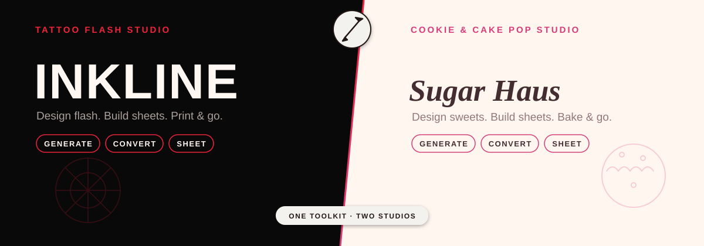

<p align="center">
  
</p>

<p align="center">
  <em>One toolkit. Two studios. Offline-first design, from prompt to printed sheet.</em>
</p>

# Inkline

Inkline is a single design toolkit that reskins into two studios at the door:

- **Ink Lab** — tattoo flash design. Dark, crimson, mono display type.
- **Sugar Haus** — cookie / cake-pop / topper design for The Sugar Haus
  Bakery. Warm cream, rose, script wordmark.

Pick a studio and everything — theme, copy, style options, prompt language —
reskins to match. Designs, libraries, and saved sheets never mix between
studios. Studio-specific copy and image-model prompt language live in
[`src/lib/brands.ts`](src/lib/brands.ts) (web) and
[`mobile/src/lib/brands.ts`](mobile/src/lib/brands.ts) (app), kept in sync by
hand.

**Live at [inkline.expo.app](https://inkline.expo.app)** — the same Expo app
that ships to iOS also builds and deploys as the web client. There is no
separate web front end; see [Architecture](#architecture) below.

## The three core tools

Every studio gets the same three tools, themed to match:

- **Generate** — describe a piece and get clean black-line art on white.
  Choose Gemini, OpenAI GPT Image, or a Claude-directed Gemini workflow
  (Claude only returns text, so it does art direction and Gemini renders).
  Ten Ink Lab styles (traditional, fine line, blackwork, irezumi, black &
  grey, neo-traditional, chicano, dotwork, geometric, tribal) each carry
  their own ink constraints, plus a shading vocabulary (line only, whip,
  pepper, grey wash, hatching, solid black) that's independent of style.
- **Convert** — drop in a photo and get clean line art back via Sobel edge
  detection, entirely on-device (`react-native-skia` in the app, canvas in
  the browser) — no server round-trip, no photo ever leaves the device.
- **Sheet** — drag, pinch-resize, and twist-rotate designs onto
  Letter/Tabloid/A4/Square layouts and print or share at true physical size.

## Everything built on top of that

What started as three tools has grown into a full offline-first creative
workspace. Organized by what it's for:

**Editing**
Full-screen layered editor (`mobile/src/components/DesignEditor.tsx`) over a
versioned project model (`designProject.ts`) — raster, stroke, shape, and
text layers with per-layer transforms, visibility, lock, and opacity; bounded
undo/redo snapshots; SVG export. Plus a vector node editor for direct point
editing (`nodeEdit.ts`), symmetry/radial drawing (`symmetry.ts`), pressure-
and tilt-aware pen input (`penInput.ts`), curve warp for wrapping art onto a
cylindrical surface (`curveWarp.ts`), a lettering studio that traces script
to editable vector strokes (`lettering.ts`, `letteringRender.ts`), and a
smart cleanup assistant that finds stray specks and bridges broken lines in
one undo (`cleanup.ts`).

**From paper**
Photographed sketches are squared up before anything reads them as a stencil —
the sheet is found against the bench, its corners recovered by intersecting the
fitted edges, and the photo resampled flat (`sketch.ts`, `sketchDeskew.ts`). The
tracer then collapses the three passes an artist makes at one line into one
line, while leaving a deliberate double line alone.

**Library & organization**
Search, tags, and favorites (`libraryFilter.ts`); one-tap remix from any
saved design with a set of composable remix verbs — simpler, bolder, more
symmetrical (`remix.ts`); batch conversion of up to 12 photos through one
trace preset (`batch.ts`); non-destructive version history alongside the
undo/redo snapshots (`VersionHistory.tsx`).

**Client & production workflow**
Client/order projects with appointments, placement, dimensions, and
reference notes (`clientProjects.ts`); branded approval-proof PDFs rendered
at true printed size (`proofSheet.ts`); quoting that turns true size, detail
density and placement difficulty into hours and a figure, with a whole batch
order — counts, sheets, icing by colour, price — planned in one pass
(`quote.ts`); a material-cost and sheet-yield planner for orders (`yield.ts`); a print log that remembers what was printed
so it can be reprinted (`printLog.ts`); reusable per-brand session defaults
for trace thresholds, brush size, and sheet templates (`preferences.ts`);
auto-pack sheet layout (`autopack.ts`); a minimum-line-spacing / blowout
checker and other production readiness checks, including Sugar Haus icing
piping feasibility (`spacing.ts`, `productionTools.ts`, `icingRecipe.ts`).

**Preview & aftercare**
Live camera AR placement preview (`PlacementPreview.tsx`) with a healed-look
overlay (`healing.ts`) and a healed-tattoo timeline that records how a piece
actually healed over time (`healedAge.ts`, `healedRecords.ts`). Previews draw
against skin rather than flash paper, with six Fitzpatrick-derived tones and a
warning when a line is too fine to hold on the one chosen (`skinTones.ts`); a
cover-up check measures whether a design lays down enough ink to bury the
tattoo already there (`coverup.ts`). Linework can be redrawn at the width the
chosen needle grouping or piping tip really leaves, thickening where the hand
slowed (`material.ts`). Clients leave with a card personalised to their own
piece — placement, size, coverage and session date — that opens with no signal
(`aftercare.ts`).

**From design to 3D printer**
A drawing becomes a printable casting tray: closed boundaries traced from the
artwork (`contour.ts`), extruded into a watertight mesh (`solid.ts`), and
written as binary STL in millimetres (`stl.ts`). The tray is a walled box with
the shapes standing proud of its floor (`castingTray.ts`), packed as many
cavities to a pour as asked for, arranged as close to square as the bed wants,
and flared where each shape meets the floor so the silicone gets a slope to
peel off rather than a square notch to tear at. The drawing's own lines then
stand proud of the filled body, so the piece carries the picture instead of
casting as a flat slab of its own silhouette — silicone poured in cures around
it all, and *that* is the mold. Nothing printed ever touches food.
Before it exports it says what will go wrong: detail under two nozzle widths
does not print badly, it does not print at all.

**Portability & sync**
AES-256-GCM encrypted backup archives with the key held in `SecureStore`
(`encryptedBackup.ts`, schema/validation split out into
`backupArchive.ts` so the malformed-archive paths are unit-testable without
a native runtime); studio-to-studio handoff over AirDrop
(`handoff.ts`); and design-library sync across phone, iPad, and browser
(`librarySync.ts`, `syncPlan.ts`).

**Visual language**
A deterministic paper-grain substrate so the stock texture is reproducible
(`paper.ts`), timed stencil-reveal animation (`reveal.ts`), and a shared
semantic icon set mapped to SF Symbols with an Ionicons fallback
(`icons.ts`).

Most of this lives under `mobile/src/lib/*.ts` as pure, unit-tested
functions — 711 tests as of this writing (`npm test` in `mobile/`) — with
UI wired on top in `mobile/src/app/[brand]/*.tsx` and
`mobile/src/components/`.

## Architecture

**`mobile/` is the whole app.** It's an Expo + React Native project that
targets iOS, Android, *and* web from one codebase — the web build at
[inkline.expo.app](https://inkline.expo.app) is `npx eas-cli deploy --prod`
from `mobile/`, not a separate front end. An older Next.js UI used to live
under `src/app/[brand]/` at the repo root; it's a fraction of the app now
and no longer the primary client.

**This repo root is the generator API.** The Next.js app here, deployed on
Railway, exposes `/api/generate` (and `/api/library`) — the server-side
image-generation endpoint the mobile/web client calls. It has no UI of its
own that matters day to day.

**Platform differences live in `.web.ts` siblings**, never in branches
inside a screen: `designFiles`, `projectStore`, `imageSource`, `files`,
`printing`, `skiaReady`, `blePrinter` all have native/web pairs. Skia is
WebAssembly in a browser and binds its whole API at import time, so
`mobile/index.web.js` loads CanvasKit before requiring the app — anything
that imports Skia before that binds to `undefined`.

```
tattoodesign/
├── src/app/api/generate/     Next.js image-generation endpoint (Railway)
├── mobile/                   the actual app — Expo, targets iOS/Android/web
│   ├── src/app/[brand]/      screens: index, generate, convert, builder,
│   │                         projects, settings
│   ├── src/components/       DesignEditor, PlacementPreview, OrderPlanner,
│   │                         HealedTimeline, VersionHistory, ...
│   └── src/lib/              ~90 files of pure, unit-tested logic
├── docs/                     wave-plan delivery docs (see below)
└── public/                   deployed Expo web export (build output, not
                               source — excluded from lint)
```

## Getting started

```bash
cd mobile
npm install
npx expo start
```

Scan the QR code with Expo Go, press `i` for the iOS simulator (needs a Mac
+ Xcode), or press `w` to run it in a browser.

By default the app talks to the Railway-hosted generator API. To point it at
a local `next dev` instance instead, copy `mobile/.env.example` to
`mobile/.env.local` and set `EXPO_PUBLIC_API_BASE_URL` to your machine's LAN
address (not `localhost` — the simulator/device needs a reachable host),
e.g. `http://192.168.1.23:3000`.

### Generator API setup

If you're running the generator locally, copy `.env.example` to `.env.local`
at the repo root and set keys for whichever models you want:

```
GEMINI_API_KEY=your-key-from-https://aistudio.google.com/apikey
OPENAI_API_KEY=your-openai-api-key
ANTHROPIC_API_KEY=your-anthropic-api-key
```

```bash
npm install
npm run dev
```

Without a given key, that model choice stays visible in the app but clearly
disables generation rather than faking a result.

## Testing

```bash
cd mobile
npm run lint        # expo lint
npx tsc --noEmit
npm test            # tsx --test — pure-logic unit tests
npx expo export --platform ios --output-dir /tmp/inkline-ios-export
```

The web/API side at the repo root: `npm run lint` and `npm run build`.
Both run in CI (`.github/workflows/ci.yml`) on every PR.

## Deployment

- **App (iOS/Android/web):** `npx eas-cli deploy --prod` builds and deploys
  the web target; `eas update --branch production --environment production`
  ships JS-only changes over the air to existing installs without an App
  Store review. A native/runtime version bump is only needed when a change
  touches a native module (e.g. adding `expo-crypto`/`SecureStore` bumped
  the runtime to `1.3.0`).
- **Generator API:** Railway, serving `/api/generate` behind the custom
  domain, fronted by Cloudflare.

## Where the roadmap lives

`docs/*.md` are wave-plan delivery docs — each one audits what exists,
breaks a milestone into sequential implement → PR → CI → merge → OTA waves,
and gets a `Status` line once everything in it has shipped. Check a doc's
status before treating it as a todo list — implementation has outrun the
paperwork here more than once, so an unmarked doc doesn't necessarily mean
unbuilt work. `mobile/docs/product-improvement-backlog.md` tracks smaller,
ungrouped feature ideas the same way.
